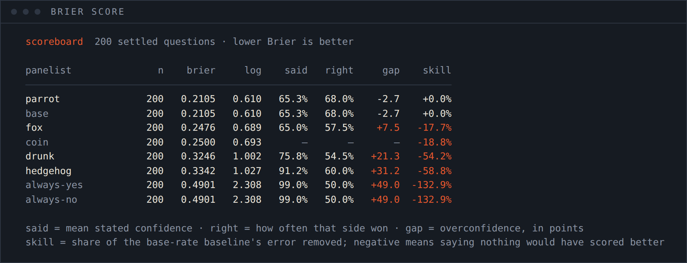
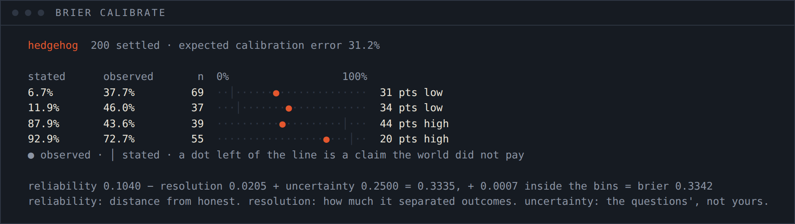
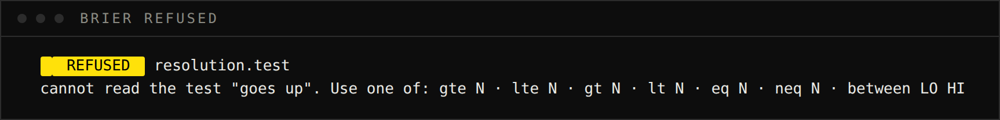
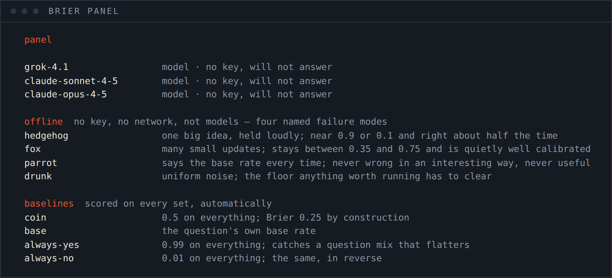
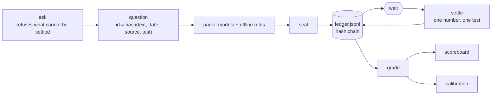

<h1 align="center">BRIER</h1>

<p align="center">
  <b>ANYONE CAN PREDICT THE FUTURE. ALMOST NOBODY KEEPS THE RECEIPT.</b><br>
  Seal a probability before the answer exists. Settle it from a source. Then find out what your
  confidence was actually worth.
</p>

<p align="center">
  
</p>
<p align="center">
  
</p>

<p align="center">
  
  
  
  
  
  
</p>

<p align="center">
  <sub><b>predicting the future with code — and then checking.</b><br>
  This repository does not predict anything. It writes down what a model predicted, seals it before the
  answer exists, and grades it later.</sub>
</p>

Ask a panel one question with a resolution date and the exact test that will settle it. Every answer is a
probability, sealed into a hash chain the moment it is given. Weeks later a resolver reads one number from
one source, applies the test the question was born with, and the arithmetic begins.

Then the number nobody publishes:

```
hedgehog             200   0.3342   1.027   91.2%   60.0%   +31.2   -58.8%
                                            said    right    gap     skill
```

**It said 91%. It was right 60% of the time.** Thirty-one points of overconfidence, and a Brier score worse
than a coin — so on this question set, saying nothing at all would have scored better. Reproduce that line
on your machine in about four seconds, with no API key:

```sh
brier demo && brier score
```

| The problem | What brier does | Command |
|---|---|---|
| "the model called it" — after the fact, from memory | the probability is hash-chained the moment it is given; one edited digit breaks the chain and names the line | `ledger --verify` |
| questions graded by whoever wrote them | a question carries its own resolver and test, fixed at ask time and hashed into its id; **rewording it makes a different question with no forecasts** | `ask` |
| "it seems fairly likely" quietly becoming 0.7 in a spreadsheet | an answer without a usable probability is recorded as a failure, not converted into one | `ask` |
| accuracy, which rewards a forecaster for only ever saying 1% and 99% | proper scoring rules, where your best score comes from stating what you believe | `score` |
| a good-looking score on a question set where most things happen | `always-yes` is on every scoreboard, automatically, and it will be brilliant on that set | `score` |
| a single number that hides why | Murphy's decomposition — reliability, resolution, uncertainty — **plus the binning residual everyone else drops** | `calibrate` |
| "was it right?" | when it said 70%, how often was it true, in bins, with the reference line drawn | `calibrate` |
| settling only the questions that went well | the ledger refuses to settle a question nobody answered | enforced |

---

## Install

Node 20 or newer. One runtime dependency. Nothing below needs an API key.

```sh
git clone https://github.com/Noisyxl/brier && cd brier
npm install
npx brier doctor
npx brier demo && npx brier score
```

```sh
# straight from GitHub, no clone
npm install -g github:Noisyxl/brier
brier doctor
```

**With no key set, the offline panel still runs, every record says so, and every command works.** That is
why `npm test` needs no network, and why someone with no API budget can read, run and check the whole thing.

|  |  |
|---|---|
| **Required** | Node ≥ 20 |
| **Runtime dependencies** | `commander` |
| **For a model panel** | `XAI_API_KEY` and/or `ANTHROPIC_API_KEY` in `.env`. Any OpenAI-compatible endpoint works |
| **Questions** | your own, with a `csv` or `manual` resolver; a seeded almanac for the demo |
| **What it trades** | nothing. There is no market, no signal and nothing to act on — [docs/SAFETY.md](./docs/SAFETY.md) |

## Sixty seconds

```sh
brier doctor      # panel, keys, series, and whether the chain is intact
brier demo        # 60 questions asked, sealed, settled and scored against the almanac
brier score       # the scoreboard, with four baselines that know nothing
brier calibrate hedgehog
brier ledger --verify
```

---

## score

<p align="center"></p>

Everything on that board was produced by four rules with no model behind them, and the result is the point:

- **the best forecaster is the one with no opinion.** `parrot` says the base rate and nothing else. It ties
  the `base` baseline exactly — which is also a self-check that the scoring is right — and it beats every
  panelist that had something to say.
- **the loudest is the worst but one.** `hedgehog` said 91% and was right 60%: a **31-point** gap and −58.8%
  skill. `drunk`, which is uniform noise, scores better.
- **`always-yes` and `always-no` land identically** at 0.4901, because this set is a coin flip overall. On a
  set where most things happen, one of them would look like a genius. That is exactly what they are there to
  catch.

`said` is mean stated confidence, folded to whichever side was taken — answering 0.2 is an 80% claim that
the thing will not happen. `gap` is `said − right`, in points. `skill` is the share of the base-rate
baseline's error removed, and it is coloured when it goes negative. [docs/SCORING.md](./docs/SCORING.md).

## calibrate

<p align="center"></p>

Read a row as: **for every forecast in this band, how often did the thing actually happen?** `│` is what was
stated, `●` is what happened, and a dot to the left of the line is a claim the world did not pay.

```
reliability 0.1040 − resolution 0.0205 + uncertainty 0.2500 = 0.3335, + 0.0007 inside the bins = brier 0.3342
```

That last term is the one this repository will not round away. Murphy's three-term identity is exact only
when forecasts are grouped by *identical* values; continuous probabilities have to be binned first, and what
is left over is the variance inside the bins. It is printed, it shrinks as `BRIER_BINS` grows, and most
write-ups drop it silently.

## ask

<p align="center"></p>

> **A question is only a question if somebody who was not there can settle it.**

So `ask` refuses anything without a future resolution date, a source, and a test that turns a reading into
true or false — and it names which one is missing, at ask time, in front of the person who can fix it.

```sh
brier ask "US 10-year yield closes at or below 4.00 on 2026-12-31" \
  --on 2026-12-31 --kind manual \
  --source "https://fred.stlouisfed.org/series/DGS10" \
  --test "lte 4.00" --base-rate 0.45
```

The question's id is a hash of the parts that decide its answer — text, date, source, test. **Reword it
afterwards and you have a different question with no forecasts against it**, which is visible immediately.
That is the quietest failure in forecast evaluation and it is closed by construction.
[docs/QUESTIONS.md](./docs/QUESTIONS.md).

## panel

<p align="center"></p>

Four forecasters that need no key and are not models. They are named failure modes, they say so in every
record they write, and they exist so a calibration diagram produced with no API budget still shows a real
shape:

| | Behaviour | What it demonstrates |
|---|---|---|
| `hedgehog` | one big idea, held loudly | the overconfidence gap, at its largest |
| `fox` | many small updates, calibrated by construction | that a modest forecaster beats a loud one on a proper rule |
| `parrot` | the base rate, every time | perfect reliability, **zero resolution** — never wrong, never useful |
| `drunk` | uniform noise | the floor anything worth running has to clear |

`fox` is the only one allowed to see the answer, through a narrow noisy channel, and **it says so in its own
source file**. A benchmark whose baseline secretly knows the answer is worthless, and the only defence is
saying it out loud. [docs/PANEL.md](./docs/PANEL.md).

## ledger

```
$ brier ledger --anchor

  brier ledger head 3cbd6ac1183ceb035aac2f9767c6921eee19035b0ed679572ccd2aa886c7786c
  over 1200 sealed records, 2026-09-06. Recompute with: brier ledger --verify
```

A forecast is only worth reading if it existed before the answer did, and **the chain cannot prove that.**
Anyone holding the file can rewrite it end to end.

What it buys is two things, and they are enough. A single edited line is obvious — change one probability
after a bad result and every hash after it stops matching. And the head is one short string you can publish
the day you seal: post it in a tweet or a commit message, and the timestamp comes from there while the chain
proves the file has not moved since. [docs/LEDGER.md](./docs/LEDGER.md).

---

## How it works



Four steps, and the third is waiting. It cannot be optimised away, which is the whole reason the demo exists.

Three properties are enforced in code rather than requested in a prompt, each with a test named after it:

- **a forecast cannot be sealed once the question is settled** — the obvious cheat
- **a question with no forecasts cannot be settled** — the quieter one: settling only what went well
- **the resolver cannot see any forecast, and the scorer cannot see the resolver** — settlement is a pure
  function of (source, test), fixed before any answer existed

[docs/ARCHITECTURE.md](./docs/ARCHITECTURE.md).

## Numbers behind the defaults

One run, offline, so anyone can reproduce it exactly:

```sh
brier demo -n 200 --seed 1950 --fresh && brier score
```

| | Measured 2026-09-06, seed 1950, offline panel |
|---|---|
| questions | 200 asked, 200 settled, all through the same validator |
| ledger | 1 200 sealed records, chain intact |
| best score | `parrot` 0.2105 — the base rate, and nothing else |
| `coin` | 0.2500, by construction |
| `hedgehog` | 0.3342 · said 91.2% · right 60.0% · **gap +31.2 points** · skill −58.8% |
| `always-yes` / `always-no` | 0.4901 each · skill −132.9% |
| expected calibration error, `hedgehog` | 31.2% |
| source | 2 376 lines of TypeScript, 1 runtime dependency |
| tests | 66, none of which touch a network |

**There is no claim about any model in this table**, because the run above has no model in it. Put your keys
in `.env`, run `brier demo --with-models`, and the same commands will produce the same table with your panel
on it — measured by you, on questions you wrote, and checkable by anyone holding the file.

## Tests

```sh
npm test
```

Sixty-six checks, none of which touch a network. The Brier scale at its anchors; a numerical proof that the
rule is proper, by sweeping every report against a 70% world and finding the minimum at 0.70; that the
decomposition and its residual reconstruct the score exactly; that a perfectly calibrated forecaster has
zero reliability and a base-rate parrot has zero resolution; four ways to break the hash chain; that a
forecast sealed after settlement is refused and a question with no forecasts cannot be settled; that a
missing CSV row is an error rather than a zero; and a whole demo ledger, end to end, twice, from the same
seed.

## FAQ

**Does it predict anything?** No. It grades what somebody else predicted. There is no signal here and
nothing to act on.

**Is the demo evidence about any model?** No — the demo panel is four rules, and the almanac is a lognormal
random walk with a label on it. A score against it says the scoring works. For evidence about a model, ask
real questions with a real resolver and wait; the waiting is the method.

**Why is the base-rate parrot winning?** Because it usually does, and that is the finding. Beating the base
rate is hard, most confident forecasting does not, and a tool that never showed you the parrot would let you
believe otherwise.

**Can I use my own questions?** That is the point. `--kind csv` with your own bars, or `--kind manual` with
a URL and the number you read. Both are recorded so the settlement can be audited.

**Can the ledger prove when I forecast something?** No, and it says so in three places. It proves the file
has not been edited since, and it gives you one short string to publish somewhere that does have a timestamp.

**What if my model refuses to give a number?** It is recorded as having failed to answer. It is not turned
into 0.5, and it is not dropped from the denominator either.

## Built on

| Source | What was taken |
|---|---|
| Glenn W. Brier, *Verification of forecasts expressed in terms of probability* (1950) | the score, the name, and the default seed |
| Allan H. Murphy, *A new vector partition of the probability score* (1973) | reliability − resolution + uncertainty |
| Philip Tetlock, *Expert Political Judgment* | the foxes and the hedgehogs, and the finding this repository measures |
| Node 20 standard library | the hash chain, the HTTP client, the test runner |
| [`commander`](https://github.com/tj/commander.js) | argument parsing, and the whole of the dependency list |

brier is independent of xAI, Anthropic and every data source named in it. Model names appear only as
configuration defaults; no marks are used and none are implied. The mark, the palette and every image in this
README are its own — [docs/BRAND.md](./docs/BRAND.md).

## License

MIT. Seal it before you know, or it does not count.
