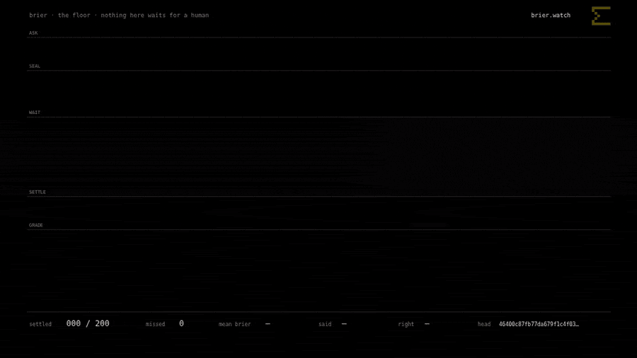
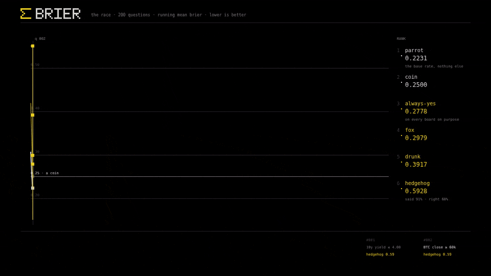
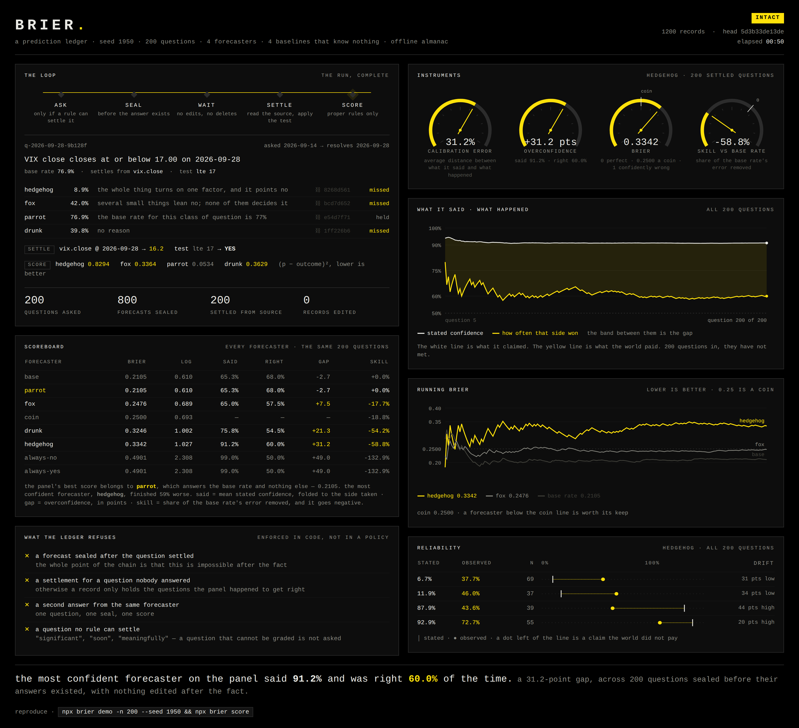
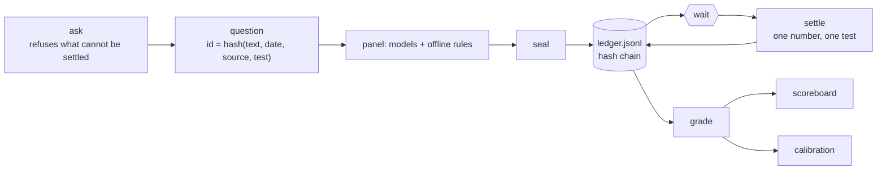

<p align="center">
  
</p>

```
  ██████╗ ██████╗ ██╗███████╗██████╗     a prediction ledger
  ██╔══██╗██╔══██╗██║██╔════╝██╔══██╗    for language models
  ██████╔╝██████╔╝██║█████╗  ██████╔╝
  ██╔══██╗██╔══██╗██║██╔══╝  ██╔══██╗    anyone can predict the future.
  ██████╔╝██║  ██║██║███████╗██║  ██║    almost nobody keeps the receipt.
  ╚═════╝ ╚═╝  ╚═╝╚═╝╚══════╝╚═╝  ╚═╝

  ────────────────────────────────────────────────────────────────────


          50$       →          750$              2 days

  ────────────────────────────────────────────────────────────────────

  200 questions, sealed before their answers existed · 1,200 records · 0 edited
  head hash dated by a block on ROBINHOOD CHAIN · chain 4663 · 4s to reproduce
```

<p align="center">
  <b>91.2% → 60.0%</b> &nbsp;·&nbsp; that arrow is the shape of a gain, pointing the other way.<br>
  <sub>Every figure comes out of a settled ledger in this repository and reproduces in four seconds with no
  API key. The head hash is dated by a block on <b>Robinhood Chain</b>, chain <code>4663</code> — a clock
  the forecaster does not own.</sub>
</p>

<p align="center">
  <a href="https://www.brier.watch/"><b>brier.watch</b></a>
  &nbsp;&nbsp;·&nbsp;&nbsp;
  <code>npx brier demo && npx brier score</code>
</p>

<p align="center">
  <sub>watch it run in a browser, or run it yourself in four seconds</sub>
</p>

<p align="center">
  <a href="https://www.brier.watch/"></a>
  
  
  
  
  
  
  
</p>

---

You ask a question. You say when it resolves and what number settles it.

A panel answers with a probability. That answer is hash-chained the second it is given, so it cannot be
changed later.

Then you wait. When the date arrives, a resolver reads one number from one source, applies the test the
question was born with, and the grading starts.

Here is the number nobody publishes:

```
hedgehog             200   0.3342   1.027   91.2%   60.0%   +31.2   -58.8%
                                            said    right    gap     skill
```

**It said 91%. It was right 60% of the time.**

That is a 31-point gap. Its Brier score is worse than a coin, which means saying nothing at all would have
scored better on this set.

Run it yourself. Four seconds, no API key:

```sh
brier demo && brier score
```

| The problem | What brier does | Command |
|---|---|---|
| "the model called it" — said afterwards, from memory | the probability is hash-chained the moment it is given. Edit one digit and the chain breaks and names the line | `ledger --verify` |
| questions graded by whoever wrote them | the question carries its own source and test, fixed when it is asked. **Reword it and it becomes a different question with no forecasts** | `ask` |
| "it seems fairly likely" turning into 0.7 in a spreadsheet | an answer with no usable number is recorded as a failure. It is not converted into one | `ask` |
| accuracy, which rewards a forecaster for only ever saying 1% and 99% | proper scoring rules. Your best score comes from saying what you actually believe | `score` |
| a good score on a question set where most things happen anyway | `always-yes` is on every scoreboard automatically, and it will look brilliant on that set | `score` |
| one number that hides why | Murphy's decomposition — reliability, resolution, uncertainty — **plus the leftover term everyone else drops** | `calibrate` |
| "was it right?" | when it said 70%, how often was it true. In bins, with the line drawn | `calibrate` |
| settling only the questions that went well | the ledger refuses to settle a question nobody answered | enforced |
| a hash chain says nothing about *when* — you hold the file, the hashes and the clock | the head hash goes onto **Robinhood Chain** and the date comes out of the block | `anchor` |

---

## What it actually does

Think of a sealed envelope.

You write down what you think will happen. You seal it. You cannot open it again. Weeks later somebody else
opens it, checks it against the newspaper, and writes down how close you were.

That is the whole tool. Everything below is the plumbing that makes it impossible to cheat.

### One question, from start to finish

This is a real record out of the ledger in this repository — not an illustration.

---

**14 September. The question is asked.**

```
VIX close closes at or below 17.00 on 2026-09-28
```

The gate checks four things. Is there a date? `2026-09-28`. A source? `vix.close`. A test that gives a
straight yes or no? `lte 17`. Is the date in the future? Yes.

It passes. It gets an id built from those parts: `q-2026-09-28-9b128f`.

Change one word of that question later and the id changes with it — so it becomes a different question, with
nobody's forecast attached. You see that immediately.

**Still 14 September. Four answers, sealed.**

```
  hedgehog    8.9%   "the whole thing turns on one factor, and it points no"   ⛓ 8268d561
  fox        42.0%   "several small things lean no; none decides it"           ⛓ bcd7d652
  parrot     76.9%   "the base rate for this class of question is 77%"         ⛓ e54d7f71
  drunk      39.8%   "no reason"                                               ⛓ 1ff226b6
```

`hedgehog` says 8.9%. Read that as: **"I am 91% sure this will not happen."**

Each answer gets a chain link the second it is written. Edit any one of those numbers afterwards and every
link after it stops matching, and `brier ledger --verify` names the exact line.

**15 to 27 September. Nothing happens.**

This is the step nobody likes and nobody can skip. A forecast is only worth reading if it existed before the
answer did, so there has to be a gap. Two weeks of it, here.

**28 September. The resolver settles it.**

It reads `vix.close` on that date and gets `16.2`. Applies the test: is `16.2 ≤ 17`? Yes.

**The answer is TRUE.**

The resolver has not seen a single one of those four forecasts. It does not know who said what, so there is
nothing to lean on.

**28 September. The scorer grades.**

```
  parrot     0.0534   held      said 76.9%, and it happened
  fox        0.3364   missed
  drunk      0.3629   missed
  hedgehog   0.8294   missed    said it was 91% not happening. It happened.
```

Lower is better. 0 is perfect, 0.25 is a coin, 1 is being certain and wrong.

The scorer never sees the resolver. It gets the sealed answers and the settled outcome, and does arithmetic.

**The forecaster that just repeated the base rate won. The confident one lost by a mile.**

Do that two hundred times and you get the number at the top of this page.

### The four parts

```
  ┌─────────────┐   ┌─────────────┐   ┌─────────────┐   ┌─────────────┐
  │  01  GATE   │ → │  02  PANEL  │ → │ 03 RESOLVER │ → │  04  SCORER │
  │  what counts│   │   answers   │   │   settles   │   │    grades   │
  └─────────────┘   └─────────────┘   └─────────────┘   └─────────────┘
     refuses a         seals a          never sees        never sees
     question no       probability      a forecast        the resolver
     rule can settle   before the
                       answer exists
```

| | Its one job | What it is not allowed to do |
|---|---|---|
| **01 · Gate** | decide what counts as a question | let through anything a rule cannot settle |
| **02 · Panel** | answer with a number, and seal it | change an answer once it is written |
| **03 · Resolver** | read the source, apply the test | see any forecast |
| **04 · Scorer** | grade the sealed answers | see or touch the resolver |

The panel is four forecasters, each a different way of being wrong:

| | |
|---|---|
| `hedgehog` | one big idea, held loudly. Says 91%, is right 60% of the time |
| `fox` | many small updates. Careful, and it wins |
| `parrot` | the base rate, every time. Never wrong, never useful |
| `drunk` | pure noise. The floor everything else has to clear |

Put an API key in `.env` and your models sit on the same board as these four, judged the same way.

---

**Why split it into four?** Because every way of cheating at forecasting is one of these parts reaching into
another.

Deciding what the question meant *after* you see the answer — the gate closed that. Changing your number
once you know — the seal closed that. Picking a source that gives the answer you want — the resolver never
sees your answer, so it has nothing to aim at. Grading only the ones that went well — the scorer cannot
choose what to settle.

Four parts that cannot reach each other is not a design detail. **It is the only reason the score means
anything.**

---

## Anchored on Robinhood Chain

> **Every forecast here can be dated by a block on Robinhood Chain — not by a
> timestamp its own author typed.**

Here is why that matters.

The hash chain proves the file has not been edited. Change one probability and every hash after it stops
matching. That part works.

But you hold the file, the hashes and the clock. So the chain cannot prove a forecast was sealed **before**
the answer existed. And that is the only claim this tool is for.

So the head hash goes somewhere with a clock you do not control:

```
0x 62726965 5d3b33de…d4a1f1 00000000000004b0
   └ "brie"  └ the chain head  └ 1200 records
```

Forty-four bytes in one ordinary transaction on **Robinhood Chain** — a public Ethereum L2 built on
Arbitrum. No contract. No token. No approval.

Anyone can check it. Open the transaction in the explorer, delete the first ten characters, and compare the
next sixty-four with what `brier ledger --verify` prints. It works from a phone.

| | before an anchor | after one |
|---|---|---|
| the file has not been edited | ✅ the hash chain | ✅ the hash chain |
| the file existed on this date | ❌ your word | ✅ **a block on Robinhood Chain** |

| Robinhood Chain | key | chain id | rpc |
|---|---|---|---|
| **mainnet** | `robinhood` | `4663` | `https://rpc.mainnet.chain.robinhood.com` |
| **testnet** | `robinhood-testnet` | `46630` | `https://rpc.testnet.chain.robinhood.com` |

Testnet is the default, so the example costs nothing and anyone can repeat it. Mainnet is one flag:
`brier anchor --network robinhood`.

The chain is not decoration. These questions settle against market readings, and Robinhood Chain is the
settlement layer for tokenised equities. Dating a forecast about that market on the ledger of that market
is the version that makes sense.

```sh
brier anchor                 # the head, the bytes, and the command to send them
brier anchor 0x<txhash>      # read it back off the chain and record it
brier anchor --check         # re-read every anchor and confirm it still matches
```

**brier holds no private key.**

It prepares the bytes and prints the command. You broadcast with your own wallet. `src/anchor/rpc.ts` has
four methods and all four read — `eth_sendRawTransaction` is not in the file.

A tool that grades your forecasts has no business being able to spend your money. The cheapest way to be
sure is for the ability to be missing from the source.

Before recording an anchor, brier checks four things:

- the RPC's own `eth_chainId` matches the chain it claims to be
- the calldata carries the `0x62726965` tag, at the right length
- **the 32 bytes match the head this file actually had at record *n***. If the chain says one thing and the
  file says another, the file is what changed
- the transaction is mined. No block, no date, no anchor

The accepted anchor is appended to the ledger and hash-chained like everything else. It is stamped with the
**block's** time — the only clock in the whole file that did not come from the author.

[docs/ANCHOR.md](./docs/ANCHOR.md).

<sub>brier is an independent open-source project. It is not affiliated with, endorsed by, or sponsored by
Robinhood Markets, Inc. The Robinhood mark identifies the chain this ledger anchors to, and belongs to its
owner.</sub>

---

## Watch it run

<p align="center">
  
</p>

<p align="center">
  <sub><b>The floor.</b> Two hundred questions through ask, seal, wait, settle and grade. Yellow is a miss.
  Full length: <a href="./assets/floor.mp4">assets/floor.mp4</a></sub>
</p>

Nothing on that screen waits for a human. Questions arrive. The panel answers. The answers are sealed. The
ledger waits. A resolver settles from a source. The grade lands.

The floor is an animation of the loop: its question cards are short labels, not the demo's questions, and
its counters are drawn for the film. The run you can reproduce to the digit is the race below.

**It runs live at [brier.watch](https://www.brier.watch/)** — the same floor, moving, in your browser.

<p align="center">
  
</p>

<p align="center">
  <sub><b>The race.</b> Running mean Brier per forecaster over two hundred questions. Lower is better.
  Full length: <a href="./assets/race.mp4">assets/race.mp4</a></sub>
</p>

The finishing order is the seed-1950 demo, the same numbers as the scoreboard further down:
`parrot` 0.2105, `fox` 0.2476, `coin` 0.2500, `drunk` 0.3246, `hedgehog` 0.3342, `always-yes` 0.4901.
The one with no opinion wins. The loudest one, which said 91% and was right 60% of the time, is beaten by
pure noise.

<p align="center">
  
</p>

Every figure on that panel is read out of a settled ledger by `scripts/viz.ts`. The needles, the curves,
the scoreboard, the chain head. Nothing is typed in by hand.

That is the only reason it is worth looking at: **the picture cannot flatter the tool.** When a run goes
badly, the panel says so.

Rebuild all of it from the file:

```sh
brier demo -n 200 --seed 1950   # the ledger the panel reads
npm run viz                     # assets/viz-data.json → assets/process.html
npm run viz:shot                # the still above
npm run viz:video               # the recording above (needs ffmpeg)
```

The two lines worth staring at are in the middle panel. White is the confidence it stated. Yellow is how
often that side actually won. Two hundred questions in, they have not met.

---

## Install

Node 20 or newer. One runtime dependency. Nothing below needs an API key.

```sh
git clone https://github.com/Noisyxl/brier && cd brier
npm install
npx brier doctor
npx brier demo && npx brier score
```

```sh
# straight from GitHub, no clone
npm install -g github:Noisyxl/brier
brier doctor
```

**With no key set, everything still runs.** The offline panel answers, every record says it was offline, and
every command works.

That is why `npm test` needs no network, and why someone with no API budget can read, run and check the
whole thing.

|  |  |
|---|---|
| **Required** | Node ≥ 20 |
| **Runtime dependencies** | `commander` |
| **For a model panel** | `XAI_API_KEY` and/or `ANTHROPIC_API_KEY` in `.env`. Any OpenAI-compatible endpoint works |
| **Questions** | your own, with a `csv` or `manual` resolver. A seeded almanac for the demo |
| **What it trades** | nothing. No market, no signal, nothing to act on — [docs/SAFETY.md](./docs/SAFETY.md) |

## Sixty seconds

```sh
brier doctor      # panel, keys, series, and whether the chain is intact
brier demo        # 60 questions asked, sealed, settled and scored
brier score       # the scoreboard, with four baselines that know nothing
brier calibrate hedgehog
brier ledger --verify
brier anchor      # the head hash, ready to date on Robinhood Chain
```

---

## score

<p align="center"></p>

Four rules with no model behind them produced that board. The result is the point:

- **The best forecaster is the one with no opinion.** `parrot` says the base rate and nothing else. It ties
  the `base` baseline exactly — which also proves the scoring is right — and it beats every panelist that
  had something to say.
- **The loudest is nearly the worst.** `hedgehog` said 91% and was right 60%. A **31-point** gap and −58.8%
  skill. `drunk`, which is pure noise, does better.
- **`always-yes` and `always-no` land on the same score**, 0.4901, because this set is a coin flip overall.
  On a set where most things happen, one of them would look like a genius. That is exactly what they are
  there to catch.

`said` is mean stated confidence, folded to whichever side was taken — answering 0.2 is an 80% claim that
it will not happen. `gap` is `said − right`, in points. `skill` is how much of the base rate's error was
removed, and it turns yellow when it goes negative. [docs/SCORING.md](./docs/SCORING.md).

## calibrate

<p align="center"></p>

Read a row like this: **for every forecast in this band, how often did the thing actually happen?**

`│` is what was stated. `●` is what happened. A dot left of the line is a claim the world did not pay.

```
reliability 0.1040 − resolution 0.0205 + uncertainty 0.2500 = 0.3335, + 0.0007 inside the bins = brier 0.3342
```

That last term is the one this repository will not round away.

Murphy's three-term identity is exact only when forecasts are grouped by *identical* values. Real
probabilities have to be binned first, and what is left over is the spread inside the bins. It is printed,
it shrinks as `BRIER_BINS` grows, and most write-ups drop it without saying so.

## ask

<p align="center"></p>

> **A question is only a question if somebody who was not there can settle it.**

So `ask` refuses anything without a future date, a source, and a test that turns a reading into true or
false. It names the missing piece straight away, in front of the person who can fix it.

```sh
brier ask "US 10-year yield closes at or below 4.00 on 2026-12-31" \
  --on 2026-12-31 --kind manual \
  --source "https://fred.stlouisfed.org/series/DGS10" \
  --test "lte 4.00" --base-rate 0.45
```

The question's id is a hash of the parts that decide its answer: text, date, source, test.

**Reword it afterwards and you have a different question with no forecasts against it.** You see that
immediately. It is the quietest failure in forecast evaluation, and it is closed by construction.
[docs/QUESTIONS.md](./docs/QUESTIONS.md).

## panel

<p align="center"></p>

These are the four from [part 02](#the-four-parts), in full.

No key, no model. Each one is a named failure mode, and each says so in every record it writes.

They exist so a calibration diagram made with no API budget still has a real shape:

| | Behaviour | What it demonstrates |
|---|---|---|
| `hedgehog` | one big idea, held loudly | the overconfidence gap at its largest |
| `fox` | many small updates, calibrated by design | a modest forecaster beats a loud one on a proper rule |
| `parrot` | the base rate, every time | perfect reliability, **zero resolution**. Never wrong, never useful |
| `drunk` | uniform noise | the floor anything worth running has to clear |

`fox` is the only one allowed to see the answer, through a narrow noisy channel — and **it says so in its
own source file**.

A benchmark whose baseline secretly knows the answer is worthless. The only defence is saying it out loud.
[docs/PANEL.md](./docs/PANEL.md).

## ledger

```
$ brier ledger --anchor

  brier ledger head 3cbd6ac1183ceb035aac2f9767c6921eee19035b0ed679572ccd2aa886c7786c
  over 1200 sealed records, 2026-09-06. Recompute with: brier ledger --verify
```

A forecast is only worth reading if it existed before the answer did. **The chain alone cannot prove that.**
Whoever holds the file can rewrite it end to end.

What it does buy is two things, and they are enough.

One edited line is obvious. Change a probability after a bad result and every hash after it stops matching.

And the head is one short string you can publish the day you seal. Post it in a tweet or a commit message.
The timestamp comes from there, and the chain proves the file has not moved since. Or put it on
[Robinhood Chain](#anchored-on-robinhood-chain) and let a block do it. [docs/LEDGER.md](./docs/LEDGER.md).

---

## wiki

```
$ brier wiki ./vault

  wiki  67 pages · ./vault
```

Open `./vault` in [Obsidian](https://obsidian.md) and the ledger becomes something you can walk around in.
Every question is a page with each sealed forecast, the reason given for it, and what happened. Every
panelist is a page with its score, its calibration table, its five worst calls and every call it ever made.
It is all linked, so the graph view shows who answered what, and backlinks answer "what else did the
hedgehog say about the 10-year yield?" in one click.

```
| panelist                        | kind         | settled | brier  | skill  |
| [[panelists/parrot|parrot]]     | offline rule | 60      | 0.2175 | +0.0%  |
| base                            | baseline     | 60      | 0.2175 | +0.0%  |
| [[panelists/fox|fox]]           | offline rule | 60      | 0.2441 | -12.2% |
| coin                            | baseline     | 60      | 0.2500 | -14.9% |
| [[panelists/drunk|drunk]]       | offline rule | 60      | 0.2678 | -23.1% |
| [[panelists/hedgehog|hedgehog]] | offline rule | 60      | 0.3188 | -46.6% |
```

<sub>The scoreboard at the top of `index.md`, after `brier demo`. Seed 1950; run it and you get these numbers.</sub>

The layout is Andrej Karpathy's **LLM wiki**: plain interlinked markdown over the raw record, an `index.md`,
a `log.md`, and an `AGENTS.md` that tells a model how the pages are organised. Point Claude, Codex or any
agent at the folder and it can help analyse the panel: who is overconfident, on which questions, and whether
anyone beats the parrot.

Two differences from a wiki a model writes, and they are the point. **The pages are compiled, not
written**: every number comes out of the ledger through the same code as `brier score`, and the same ledger
always gives the same bytes. **The ledger stays the record**: edit a page and the next `brier wiki` puts it
back; nothing in the vault is ever read into the ledger. Your own analysis, and your agent's, goes in
`notes/`, which brier creates once and never touches again.

brier will not write into a folder that already has files it did not make, so pointing it at your real
vault by mistake costs nothing.

---

## How it works



Four steps, and the third one is waiting. It cannot be skipped. That is the whole reason the demo exists.

This is the same [four parts](#the-four-parts) as above, drawn as the path a
single question takes.

Three rules are enforced in code, not asked for in a prompt. Each has a test named after it:

- **a forecast cannot be sealed once the question is settled** — the obvious cheat
- **a question with no forecasts cannot be settled** — the quiet one: settling only what went well
- **the resolver never sees a forecast, and the scorer never sees the resolver** — settlement depends only
  on the source and the test, both fixed before any answer existed

[docs/ARCHITECTURE.md](./docs/ARCHITECTURE.md). The same loop with live instruments is in
[assets/process.html](./assets/process.html) — open it in a browser, or read
[docs/VISUALIZATION.md](./docs/VISUALIZATION.md) for how it is built.

## Numbers behind the defaults

One run, offline, so anyone can reproduce it exactly:

```sh
brier demo -n 200 --seed 1950 --fresh && brier score
```

| | Measured 2026-09-06, seed 1950, offline panel |
|---|---|
| questions | 200 asked, 200 settled, all through the same validator |
| ledger | 1 200 sealed records, chain intact |
| best score | `parrot` 0.2105 — the base rate, and nothing else |
| `coin` | 0.2500, by construction |
| `hedgehog` | 0.3342 · said 91.2% · right 60.0% · **gap +31.2 points** · skill −58.8% |
| `always-yes` / `always-no` | 0.4901 each · skill −132.9% |
| expected calibration error, `hedgehog` | 31.2% |
| source | 2 376 lines of TypeScript, 1 runtime dependency |
| tests | 86, none of which touch a network |

**This table says nothing about any model**, because the run above has no model in it.

Put your keys in `.env`, run `brier demo --with-models`, and the same commands produce the same table with
your panel on it. Measured by you, on questions you wrote, checkable by anyone holding the file.

## Tests

```sh
npm test
```

Ninety-four checks. None touch a network — including the chain ones, which run against a stubbed RPC that
answers exactly what the test says and nothing else.

What they cover:

- the Brier scale at its anchors: 0 perfect, 0.25 a coin, 1 confidently wrong
- **a numerical proof that the rule is proper.** It sweeps every possible report against a 70% world and
  finds the minimum sitting at 0.70
- that the decomposition and its leftover term add back up to the score exactly
- that a perfectly calibrated forecaster has zero reliability, and a base-rate parrot has zero resolution
- four ways to break the hash chain
- that a forecast sealed after settlement is refused, and a question with no forecasts cannot be settled
- that a missing CSV row is an error, not a zero
- that an anchor on the wrong chain, an anchor carrying a head this file never had, and a second anchor from
  the same transaction are each refused, with a different reason for each
- a whole demo ledger, end to end, twice, from the same seed — proving the run is reproducible
- that the Obsidian vault has no link to a page that does not exist, shows no outcome on an open question,
  compiles to the same bytes twice, and refuses a folder it did not make

## FAQ

**Does it predict anything?**
No. It grades what somebody else predicted. There is no signal here and nothing to act on.

**Is the demo evidence about any model?**
No. The demo panel is four rules, and the almanac is a random walk with a label on it. A score against it
proves the scoring works, nothing more. For evidence about a model, ask real questions with a real resolver
and wait. The waiting is the method.

**Why is the base-rate parrot winning?**
Because it usually does, and that is the finding. Beating the base rate is hard. Most confident forecasting
does not. A tool that never showed you the parrot would let you believe otherwise.

**Can I use my own questions?**
That is the point. `--kind csv` with your own bars, or `--kind manual` with a URL and the number you read.
Both are recorded, so the settlement can be audited.

**Can the ledger prove when I forecast something?**
On its own, no — and it says so in three places. It proves the file has not been edited since. To get a date,
anchor the head on [Robinhood Chain](#anchored-on-robinhood-chain), or publish it somewhere that has its own
timestamp.

**What if my model refuses to give a number?**
It is recorded as having failed to answer. It is not turned into 0.5, and it is not quietly dropped from the
denominator either.

## Built on

| Source | What was taken |
|---|---|
| Glenn W. Brier, *Verification of forecasts expressed in terms of probability* (1950) | the score, the name, and the default seed |
| Allan H. Murphy, *A new vector partition of the probability score* (1973) | reliability − resolution + uncertainty |
| Philip Tetlock, *Expert Political Judgment* | the foxes and the hedgehogs, and the finding this repository measures |
| [Robinhood Chain](https://docs.robinhood.com/chain) | a public clock for the head hash — chain `4663`, EVM, built on Arbitrum |
| Andrej Karpathy, the *LLM wiki* pattern | the shape of `brier wiki`: markdown over the raw record, `index.md`, `log.md`, `AGENTS.md` |
| [Obsidian](https://obsidian.md) | the reader for that vault. brier writes plain markdown; nothing in it needs Obsidian to open |
| Node 20 standard library | the hash chain, the HTTP client, the test runner |
| [`commander`](https://github.com/tj/commander.js) | argument parsing, and the whole of the dependency list |

brier is independent of xAI, Anthropic, Obsidian, Robinhood Markets, Inc., Andrej Karpathy and every source
named in it. Model
names appear only as configuration defaults. No marks are used and none are implied. The mark, the palette
and every image in this README are its own — [docs/BRAND.md](./docs/BRAND.md).

## License

MIT. Seal it before you know, or it does not count.

---

## Token

brier is a free, open-source tool: a forecast ledger you can open in Obsidian as a linked
wiki, with the parrot setting the bar every model has to beat. It doesn't need a token and
doesn't use one.

If you come across a token with the same name on Robinhood Chain, it lives separately
from this code: it gives no rights, no features and no share of fees (fees go to the
launch wallet).

Please don't treat it as an investment. Crypto is risky, so only put in what you'd be
fine losing. Not financial advice.

brier is not affiliated with Robinhood Markets, Inc. or Obsidian.
