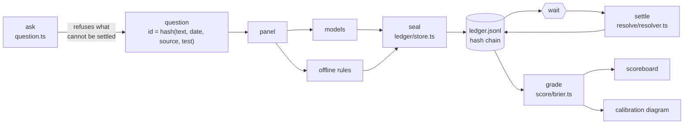

# Architecture

## The loop

Four steps, and the third one is waiting.

1. **ask** — a question is validated, given an id derived from the parts that decide its answer, and appended.
2. **seal** — every panelist answers alone; each answer is appended with the moment it was produced.
3. **wait** — nothing happens. This is the part that cannot be optimised away and the reason the demo exists.
4. **settle → score** — a resolver reads one number, applies the question's own test, and the grading is
   arithmetic over the file.

## Module boundaries

| Module | Knows about |
|---|---|
| `question.ts` | validation and ids. No ledger, no panel, no scoring |
| `ledger/` | appending and rebuilding state. Has never heard of a probability's meaning |
| `panel/` | prompts, providers, parsing. Cannot write to the ledger — it returns data, the CLI seals it |
| `resolve/` | reads one number from one place. Cannot see any forecast |
| `score/` | pure functions over `Graded[]`. No I/O at all |

The load-bearing one is the last: **the resolver cannot see the forecasts and the scorer cannot see the
resolver**. Everywhere else in this space, the person who wrote the question also decides afterwards whether
it came true; here settlement is a pure function of (source, test) that was fixed before any answer existed.

## State

There is one file and no database. `Store` replays the chain on construction and rebuilds every question,
forecast and settlement in order. Two consequences worth having:

- the file is the state, so there is nothing to migrate and nothing to fall out of sync
- the rules can be enforced on the way in *and* checked on the way out, which is what `test/ledger.test.ts`
  does by writing a ledger, reopening it, and asserting it comes back identical

## Determinism

`BRIER_SEED` fixes the almanac and every offline forecaster. The same seed produces the same questions, the
same answers, the same settlements and the same scorecards on any machine — asserted in `test/panel.test.ts`.

With models on the panel it does not, and cannot. That is why the model name and the round-trip time go into
every sealed record: the offline half of any claim is reproducible by anyone, and the model half is at least
pinned to a named model on a named day.

## Adding something

- **A forecaster** → one case in `stubForecast`, one entry in `STUBS`. Nothing else changes.
- **A resolver** → one case in `settleQuestion` and one `ResolverKind`. The scorer never learns about it.
- **A scoring rule** → a pure function in `score/` and a column. It cannot affect what was sealed.
- **A model** → one name in `BRIER_PANEL`.

## Dependencies

One at runtime: `commander`. The hash chain, the HTTP calls, the statistics and the diagram are Node's
standard library and about 2 000 lines of TypeScript you can read in an evening.

A tool whose entire claim is "you can check this yourself" does not get to arrive with four hundred
transitive dependencies.
